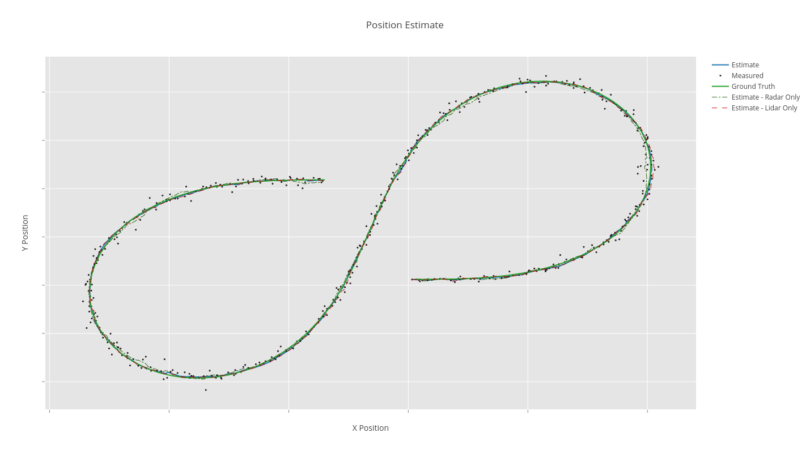
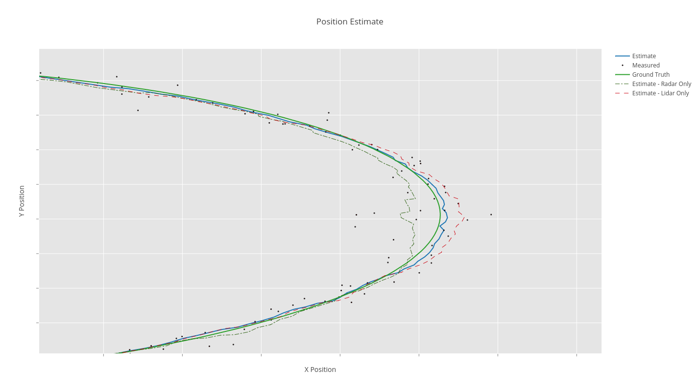
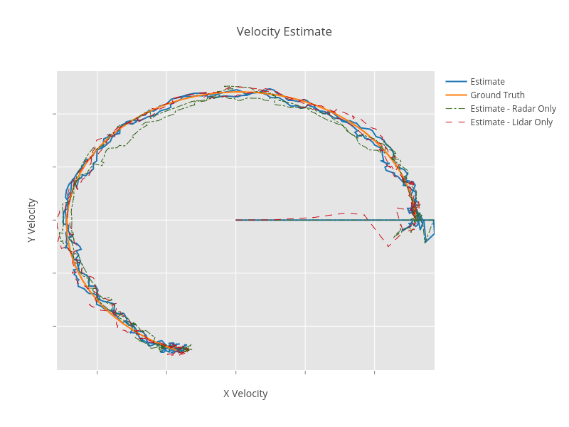

# Unscented Kalman Filter Project Starter Code
## Overview
In this project we continue the task of estimating the vehicle's 2D position based on Lidar and Radar measurements, but instead of using a linear process model and an Extended Kalman Filter. We apply a Constant Turn Rate and Velocity Magnitude Model (CTRV) instead of the linear model, since the linear model is not efficient in modelling other than linear motion. Then, instead of the Extended Kalman Filter, we use an Unscented Kalman Filter. 

The basic idea of the Unscented Kalman Filter is to use the statistical properties of the system to generate a number of states, called sigma points, which are well distributed across the uncertainty field. Then update each of these state predictions and then average the predictions as well as their covariances. If the measurement is also nonlinear, in the case of the radar measurement, we apply a measurement prediction step using each of the sigma points then perform the measurement update, and finally average the sigma points into a single state estimate.
  
 If the measurement is linear, we just apply the standard Kalman Filter measurement update step to the weight averaged points from the process prediction step.
 ## Files
 - The data folder contains the input and output files
 - The UKF-Visualization Jupyter Notebook can be used to visualize the results
 - The main_file.cpp is used to process the data in the text files
 - The main.cpp is used to run a server to connect to the simulator. 
  
 ## Results
 Better performance is achieved when using the CTRV model with Unscented Kalman Filter, compared to the linear model with an Extended Kalman Filter.
  
 The table below compares the root mean square error between the two methods, for the same data set. Note: The measurement error covariance for the sensors are fixed, the process noise is computed differently in each case. 
 
|    State   |  UKF  |  EKF  |
|:----------:|:-----:|:-----:|
| X Position | 0.069 | 0.097 |
| Y Position | 0.081 | 0.086 |
|   X Speed  |  0.28 |  0.38 |
|   Y Speed  |  0.18 |  0.47 |
 ----
The program performed well with the simulator as well.

Here is a figure showing the ground truth position, the measurements, and the UKF estimates. The figure also shows the UKF estimates using the radar and lidar separately. 

And here is a zoomed in version of the above figure, notice how the combined lidar and radar measurement reduce the error at the highly nonlinear section of the path.

And here is a figure showing the velocity estimate compared with the ground truth, as well as velocity estimates for use of each of the radar and lidar measurements separately. The big error in the middle is due to the initial error, but the velocity estimate converges quickly within 4 samples.

The EKF and UKF projects were a good chance to practice Sensor Fusion applications, ideally, one would like to animate the error standard deviation ellipse as an animation, to get a good grasp on the moving error, but that's a separate Python exercise.
 
 

